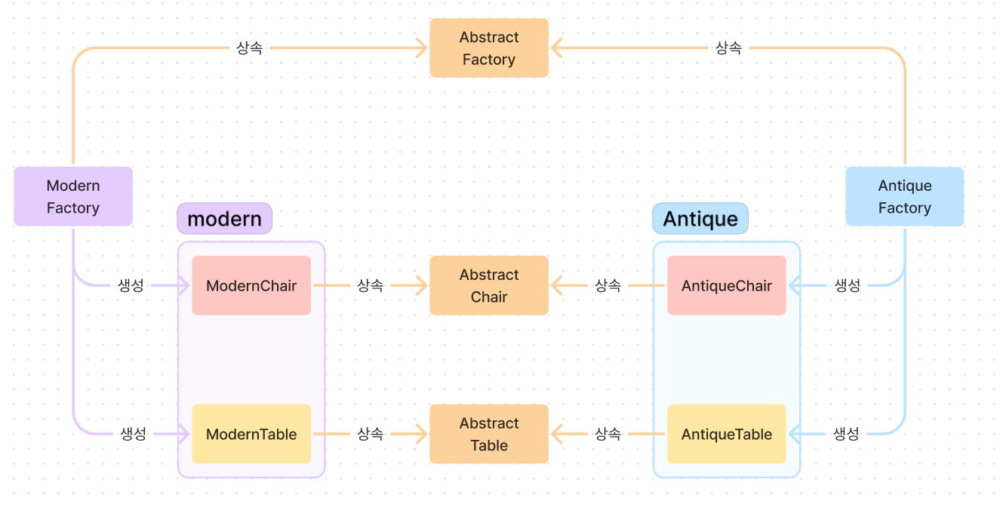

# Abstract Method

연관성있는 객체군들을 묶어 추상화하는 기법이다.

팩토리 객체에서 객체군을 생성한다.

## 예시

카페를 운영하고있다.
상황은 다음과 같다.

1. 사람들이 물건을 들고온다.
2. 마음에 드는 자리를 선택한다.
3. 의자에 앉는다.
4. 책상에 물건을 올린다.
5. 일을 시작한다.
6. 일을 끝마친다.

손님의 만족을 위해 가구를 태마별로 분리하였다.
또한 추가적인 가구 태마가 들어올 수 있으며 그에 대비하여야 한다.

### 구현

가구들의 관리와 확장에 용이하게 Abstract Factory를 적용시켜 가구를 태마와 종류로 분리 후 추상화 하였다.

#### 구조



#### 코드

```py
from abc import ABC, abstractmethod

class AbstractChair(ABC):
    @abstractmethod
    def sit(self):
        pass

class Modernchair(AbstractChair):
    def sit(self):
        print("세련된 의자에 앉는다.")

class AntiqueChair(AbstractChair):
    def sit(self):
        print("고풍스러운 의자에 앉는다.")

class AbstractTable(ABC):
    @abstractmethod
    def put(self, object:str):
        pass

    def work(self, chair:AbstractChair, object:str):
        chair.sit()
        self.put(object)
        print("일을 시작한다.")

class ModernTable(AbstractTable):
    def put(self, object: str):
        print(f"세련된 탁자에 {object}(를)을 놓는다.")

class AntiqueTable(AbstractTable):
    def put(self, object: str):
        print(f"세련된 탁자에 {object}(를)을 놓는다.")

class AbstractFactory(ABC):
    @abstractmethod
    def create_chair(self) -> AbstractChair:
        pass

    @abstractmethod
    def create_table(self) -> AbstractTable:
        pass

    def work(self, name:str, object:str): # Factory Method와 같이 사용되었다.
        chair = self.create_chair()
        table = self.create_table()

        print(f"{name}(이)가 {object}(를)을 들고 온다.")
        table.work(chair=chair, object=object)

class ModernFactory(AbstractFactory):
    def create_chair(self) -> AbstractChair:
        return Modernchair()

    def create_table(self) -> AbstractTable:
        return ModernTable()

class AntiqueFactory(AbstractFactory):
    def create_chair(self) -> AbstractChair:
        return AntiqueChair()

    def create_table(self) -> AbstractTable:
        return AntiqueTable()

def work(factory:AbstractFactory, name:str, object:str):
    print("========================")
    factory.work(name, object)
    print(f"{name}(이)가 일을 끝냈다.")
    print("========================")

if __name__ == "__main__":
    work(ModernFactory(), "대호", "노트북")
    work(AntiqueFactory(), "세희", "볼팬과 노트")
```

#### 결과

```
========================
대호(이)가 노트북(를)을 들고 온다.
세련된 의자에 앉는다.
세련된 탁자에 노트북(를)을 놓는다.
일을 시작한다.
대호(이)가 일을 끝냈다.
========================
========================
세희(이)가 볼팬과 노트(를)을 들고 온다.
고풍스러운 의자에 앉는다.
세련된 탁자에 볼팬과 노트(를)을 놓는다.
일을 시작한다.
세희(이)가 일을 끝냈다.
========================
```

## 정리

Abstract Factory는 객체군의 생성과 관리에 중점을 두었다.

Abstract Factory를 잘 이해하고 관리와 확장이 좋은 코드를 작성하도록 하자.

### +추가

더 내 스타일로 바꿨다.

```py
from abc import ABC, abstractmethod

class AbstractStyle(ABC):
    @abstractmethod
    def get_style(self) -> str:
        pass

class ModernStyle(AbstractStyle):
    def get_style(self) -> str:
        return "세련된"

class AntiqueStyle(AbstractStyle):
    def get_style(self) -> str:
        return "고풍스러운"

class AbstractFurniture(ABC):
    def __init__(self, style:AbstractStyle) -> None:
        self.style:AbstractStyle = style
        self.furniture:str

    def introduce(self):
        return f"{self.style.get_style()} {self.furniture}"

class Chair(AbstractFurniture):
    def __init__(self, style: AbstractStyle) -> None:
        super().__init__(style)
        self.furniture = "의자"

    def sit(self):
        print(f"{self.introduce()}에 앉다")

class Table(AbstractFurniture):
    def __init__(self, style: AbstractStyle) -> None:
        super().__init__(style)
        self.furniture = "탁자"

    def put(self, object:str):
        print(f"{self.introduce()}에 {object}(를)을 놓는다.")

    def work(self, chair:Chair, object:str):
        chair.sit()
        self.put(object)
        print("일을 시작한다.")

class AbstractFactory(ABC):
    def __init__(self) -> None:
        self.style:AbstractStyle

    @abstractmethod
    def create_chair(self) -> Chair:
        pass

    @abstractmethod
    def create_table(self) -> Table:
        pass

    def work(self, name:str, object:str): # Factory Method와 같이 사용되었다.
        chair = self.create_chair()
        table = self.create_table()

        print(f"{name}(이)가 {object}(를)을 들고 온다.")
        table.work(chair=chair, object=object)


class ModernFactory(AbstractFactory):
    def __init__(self) -> None:
        self.style:AbstractStyle = ModernStyle()

    def create_chair(self) -> Chair:
        return Chair(self.style)

    def create_table(self) -> Table:
        return Table(self.style)

class AntiqueFactory(AbstractFactory):
    def __init__(self) -> None:
        self.style:AbstractStyle = AntiqueStyle()

    def create_chair(self) -> Chair:
        return Chair(self.style)

    def create_table(self) -> Table:
        return Table(self.style)

def work(factory:AbstractFactory, name:str, object:str):
    print("========================")
    factory.work(name, object)
    print(f"{name}(이)가 일을 끝냈다.")
    print("========================")

if __name__ == "__main__":
    work(ModernFactory(), "대호", "노트북")
    work(AntiqueFactory(), "세희", "볼팬과 노트")
```
