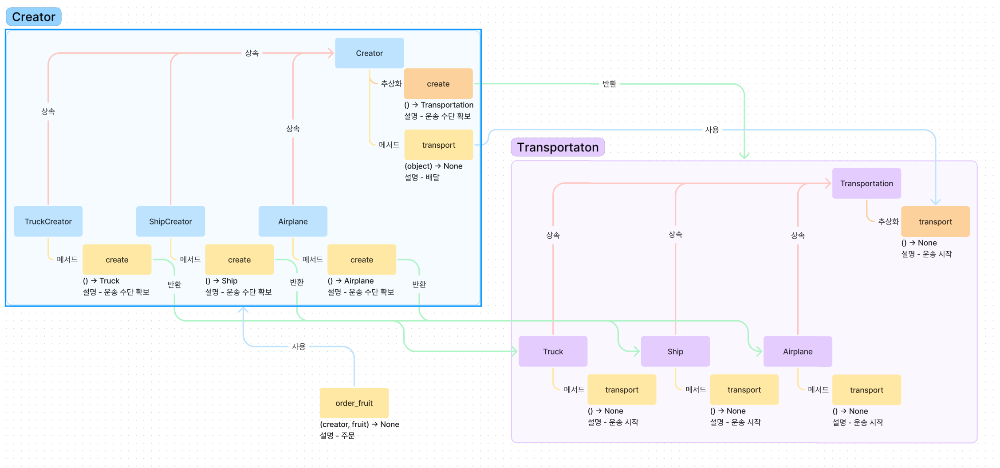

# Factory Method

Factory Method는 객체의 생성과 사용을 분리하는 기법이다.

객체의 사용을 상위 클래스에서 진행되며, 객체의 생성은 하위 클래스가 결정한다.

## 예시

### 상황 설명

과일 배달 서비스를 운영하고 있다.
과정은 다음과 같다.

1. 배달할 지역을 확인 후 운송 수단을 선택한다.(트럭 or 배)
2. 주문을 접수하고 알린다.
3. 배송을 준비하고 알린다.
4. 운송 수단을 확보하고 운송을 시작한다.
5. 배송을 완료하고 알린다.

운송 수단은 Object를 받아 운송하는 Transport라는 method를 가진다.

지원 가능한 배송지는 앞으로 더 확장될 수 있으며 그에 대비하여야 한다.

### 구현

1~2번을 주문, 3~5번을 배송으로 나누도록 하겠다.

배송 파트의 3번과 5번은 중복되어 있지만 4번은 운송지에 따라 운송 수단이 바뀌게 된다.

배송 파트에 Factory Method를 적용시켜
배송의 준비와 운송의 시작, 그리고 배송 완료는 상위 클래스에 구현하고
운송 수단의 확보는 하위 클래스에 위임하도록 하겠다.

#### 구조


#### 코드

```py
from abc import ABC, abstractmethod

class Transportation(ABC):
    def __init__(self) -> None:
        super().__init__()
        print("Transportation 생성")

    @abstractmethod
    def transport(self, object):
        pass

class Truck(Transportation):
    def __init__(self) -> None:
        super().__init__()
        print("Truck 생성")

    def transport(self, object):
        print(f"Truck 운송 -> {object}")

class Ship(Transportation):
    def __init__(self) -> None:
        super().__init__()
        print("Ship 생성")

    def transport(self, object):
        print(f"Ship 운송 -> {object}")

class TransportationCreator(ABC):

    @abstractmethod
    def create(self) -> Transportation:
        pass

    def transport(self, object):
        print("운송 준비")
        transportation = self.create()
        transportation.transport(object)
        print("운송 완료")

class TruckCreator(TransportationCreator):
    def create(self) -> Transportation:
        return Truck()

class ShipCreator(TransportationCreator):
    def create(self) -> Transportation:
        return Ship()

def order_fruit(creator:TransportationCreator, fruit:str):
    print(f"{fruit} 주문")
    creator.transport("apple")


if __name__ == "__main__":
    orders = [("apple", "육지"), ("apple", "바다"), ("banana", "육지"), ("banana", "바다")]

    for fruit, address in orders:
        if address == "육지":
            order_fruit(TruckCreator(), fruit)
        elif address == "바다":
            order_fruit(ShipCreator(), fruit)
        else:
            raise "지원하지 않는 주소"
        print("--------------------------------")
```

#### 결과

```
apple 주문
운송 준비
Transportation 생성
Truck 생성
Truck 운송 -> apple
운송 완료
--------------------------------
apple 주문
운송 준비
Transportation 생성
Ship 생성
Ship 운송 -> apple
운송 완료
--------------------------------
banana 주문
운송 준비
Transportation 생성
Truck 생성
Truck 운송 -> apple
운송 완료
--------------------------------
banana 주문
운송 준비
Transportation 생성
Ship 생성
Ship 운송 -> apple
운송 완료
--------------------------------
```

### 확장

이제 비행기를 통해 하늘에도 배달할 수 있게 되었다.

#### 구조



#### 코드

```py
from abc import ABC, abstractmethod

class Transportation(ABC):
    def __init__(self) -> None:
        super().__init__()
        print("Transportation 생성")

    @abstractmethod
    def transport(self, object):
        pass

class Truck(Transportation):
    def __init__(self) -> None:
        super().__init__()
        print("Truck 생성")

    def transport(self, object):
        print(f"Truck 운송 -> {object}")

class Ship(Transportation):
    def __init__(self) -> None:
        super().__init__()
        print("Ship 생성")

    def transport(self, object):
        print(f"Ship 운송 -> {object}")

class Airplane(Transportation):
    def __init__(self) -> None:
        super().__init__()
        print("Airplane 생성")

    def transport(self, object):
        print(f"Airplane 운송 -> {object}")

class TransportationCreator(ABC):

    @abstractmethod
    def create(self) -> Transportation:
        pass

    def transport(self, object):
        print("운송 준비")
        transportation = self.create()
        transportation.transport(object)
        print("운송 완료")

class TruckCreator(TransportationCreator):
    def create(self) -> Transportation:
        return Truck()

class ShipCreator(TransportationCreator):
    def create(self) -> Transportation:
        return Ship()

class AirplaneCreator(TransportationCreator):
    def create(self) -> Transportation:
        return Airplane()

def order_fruit(creator:TransportationCreator, fruit:str):
    print(f"{fruit} 주문")
    creator.transport("apple")


if __name__ == "__main__":
    orders = [("apple", "육지"), ("banana", "육지"),
              ("apple", "바다"), ("banana", "바다"),
              ("apple", "하늘"), ("banana", "하늘")]

    for fruit, address in orders:
        if address == "육지":
            order_fruit(TruckCreator(), fruit)
        elif address == "바다":
            order_fruit(ShipCreator(), fruit)
        elif address == "하늘":
            order_fruit(AirplaneCreator(), fruit)
        else:
            raise "지원하지 않는 주소"
        print("--------------------------------")
```

#### 결과

```
apple 주문
운송 준비
Transportation 생성
Truck 생성
Truck 운송 -> apple
운송 완료
--------------------------------
banana 주문
운송 준비
Transportation 생성
Truck 생성
Truck 운송 -> apple
운송 완료
--------------------------------
apple 주문
운송 준비
Transportation 생성
Ship 생성
Ship 운송 -> apple
운송 완료
--------------------------------
banana 주문
운송 준비
Transportation 생성
Ship 생성
Ship 운송 -> apple
운송 완료
--------------------------------
apple 주문
운송 준비
Transportation 생성
Airplane 생성
Airplane 운송 -> apple
운송 완료
--------------------------------
banana 주문
운송 준비
Transportation 생성
Airplane 생성
Airplane 운송 -> apple
운송 완료
--------------------------------
```

## 정리

Factory Method는 객체에 생성보다 사용에 중점을 둔 디자인 패턴이다.

Factory Method의 특성을 잘 이해하고 사용하여 보기 좋고 확장이 편한 코드를 작성하도록 하자
